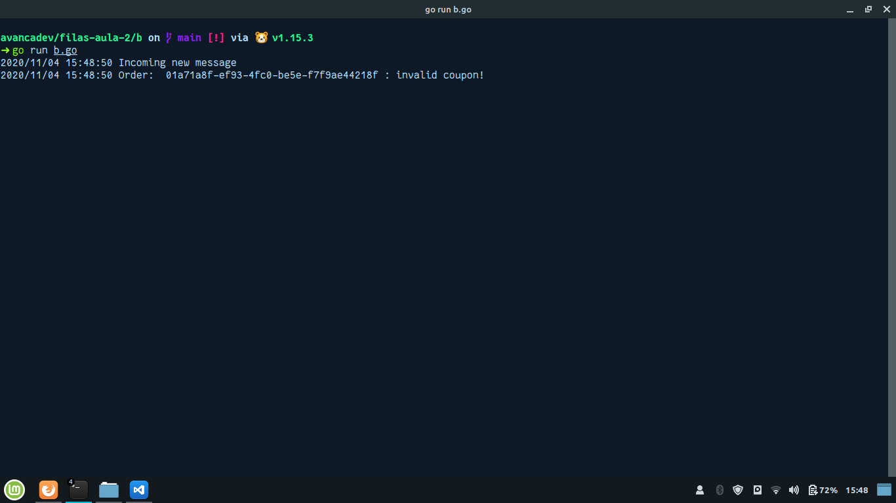
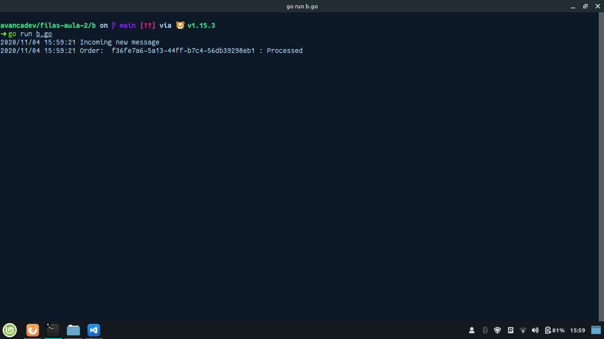
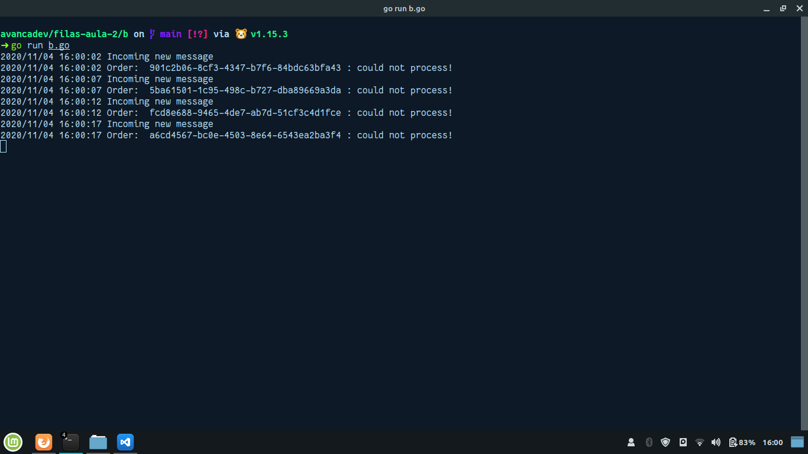

# AvançaDEV

## Desafio 1

- Crie um microsserviço número 4 na linguagem de sua preferência e faça com que o microsserviço número 3 (de validação de cupons) faça uma chamada a ele.

- Lembre-se de adicionar uma regra de retry para caso o microsserviço 4 estiver fora do ar temporariamente, o microsserviço 3 ainda tentará algumas vezes antes de desistir.

```javascript
const http = require('http');

const host = 'localhost';
const port = 9093;

const json = JSON.stringify({
    Status: "OK",
});

const requestListen = (req, res) => {
    res.setHeader("Content-Type", "application/json")
    res.writeHead(200);
    res.end(json)
}

const server = http.createServer(requestListen);

server.listen(port, host, () => {
    console.log(`Server is running on http://${host}:${port }`)
});
```

## Desafio 2

- Inicie o RabbitMQ e faça as configurações das duas filas e das duas exchanges.

- Coloque os microsserviços para funcionar.

- Tire 3 prints de sua de sua tela mostrando os microsserviços funcionando nas 3 situações: Cupom inválido, Processed e Connection error.

### Cupom Inválido



### Processado



### Error de conexão



---

Desenvolvido durante o avancadev :wave:
